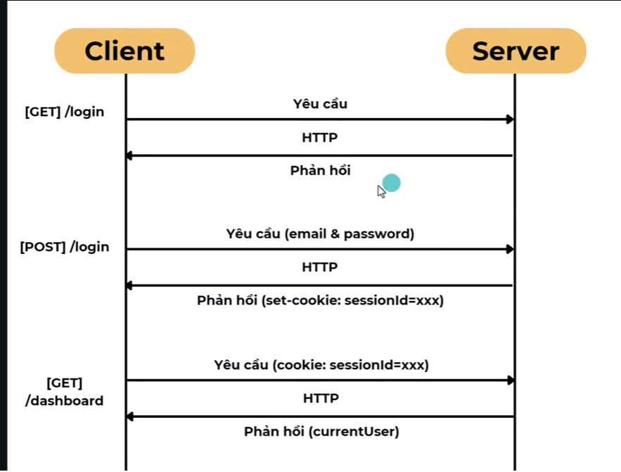

# Some local server in computer

1. Loopback: 127.0.0.1/::1/localhost
   This is the internal network in computer. With its name "Loopback", partially we can understand the property of this type. it would be access in your internal network circularly and not go out of external network like internet

For example, when you run localhost:3000, the browser will run on loopback network

2. External Network (or Internet)

# HTTP -> stateless

Why it's stateless. -> Between every request and response would be independent.
So that in every request we send from client to server. all the information would be not the same and the latest will not keep anything from the last request. So that how can we keep some important information such as user login info

# Cookie vs Session

Cookie:
Cookie is a small value saved on client-side with have storage size about 45kb
There are some features and configurations that we can have such as:

- Domain: Config for domain and subdomain applied in
- Path: Specify the path on browser that can be applied for this data
- Expire: Set timer for Expire Date
- Session Cookie: will turn off when browser turn off
- httpOnly: create, use and access only on server-side (BE). client-side just store it. Can we access it from client-side? Yes, We can write utils on client-side and involve by api. Note: we can access directly by the JS script
- Secure: only available when using HTTPS

Session:
Session used for keep user data when logged (Log-in Session) or create cart (e-commerce) and stored on server-side (BE). Not stored on client-side.

To make session work, regularly we send session on server-side (BE) to client-side (FE) by Cookie and then store it on (FE).

Do the session creation depends on Cookie?
-> No, Cookie is the regular choice, but not usually. We can use URLParam, example: http://localhost:3000/dashboard?sessionid=xxx. But it doesn't secure, and it make inconvenient for handling and appearance.

Would cookie and session be deleted when turn off browser?
-> Session Cookie would be deleted on browser

Where would be used to store the Session?
-> Many ways. redis, memcache (sync disk), file. they are (RAM), database...

